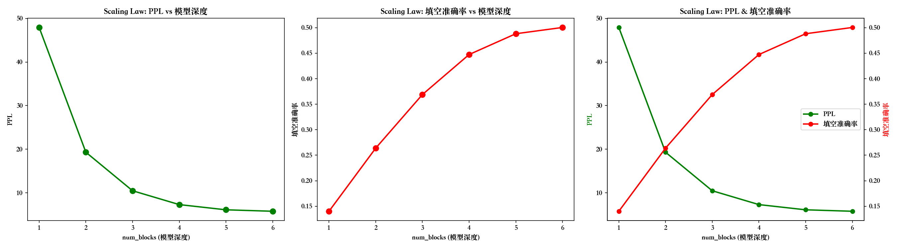

# 字符级 Transformer 与 Attention Sink 实验

从零实现字符级 Transformer，集成 StreamingLLM 风格的 Attention Sink 机制，并在 WikiText-103 上进行 Scaling Law 分析和 Token Cluster 可视化。

## 架构

- **RoPE** 旋转位置编码（仅作用于 Q、K）
- **StreamingMultiHeadAttention** 因果注意力 + KV Cache（Ring Buffer）+ Sink Tokens
- **SwiGLU** 前馈网络 + **Pre-RMSNorm** + 残差连接
- 权重共享：一个物理 TransformerBlock 循环使用 `num_blocks` 次，每层独立 KV Cache

## 文件结构

```
src/
├── transformer_module.py       # 核心模型：RoPE, MHA, StreamingMHA, ToyModel 等
├── attention_sink_module.py    # 实验管理：训练、评估、生成、分类
├── main.py                     # 完整流程：评估 → Scaling Law → 拟合 → 动画
├── analysis.py                 # Scaling Law 曲线拟合与 2×2 图表
├── animation.py                # Token Cluster PCA 动画
└── anim_only.py                # 极简入口：只生成 gif
notebooks/
├── Transformer_and_attention_sink.ipynb   # 构建讲解笔记
└── Transformer_and_attention_sink.pdf
```

## 快速开始

```bash
pip install -r requirements.txt

# 从 checkpoint 加载模型，运行完整评估 + 可视化
python src/main.py

# 仅生成 Token Cluster 动画
python src/anim_only.py
```

需要提前在 `src/` 目录下放置 `attention_sink_checkpoint.pth`（训练好的模型权重）。

## 实验结果

### Scaling Law（深度 vs 性能）

在 WikiText-103 validation 集上，固定权重、变化虚拟层数（1~6）：

- **A. PPL 幂律拟合**：PPL(L) = A·L^(-α) + C，其中 C 为不可还原熵
- **B. PPL → 准确率转换效率**：Acc = β·ln(1/PPL) + K
- **C. Sink Rate 衰减场**：SinkRate(L) = S₀·e^(-λL) + k



### Token Cluster 演化动画

把每个 token 视为粒子，层数视为时间，用 PCA 观察 L2 归一化后的隐藏状态如何逐渐聚类：

- **Sink Token**（棕色星形）：每个序列位置 0 的 `<pad>` token，是模型的 attention sink
- 字母 / 数字 / 空格 / 标点在深层逐渐分离


## 评估指标

| 指标 | 含义 |
|------|------|
| PPL | 困惑度，越低越好 |
| Cloze Accuracy | 字符级 next-token 预测准确率 |
| Sink Rate | 前 sink_size 个位置获得的注意力比例 |

## 模型参数

```
num_blocks = 6,  num_heads = 8,  d_model = 512
sink_size = 1,   window_size = 30
learning_rate = 1e-4,  max_seq_len = 4096
```
